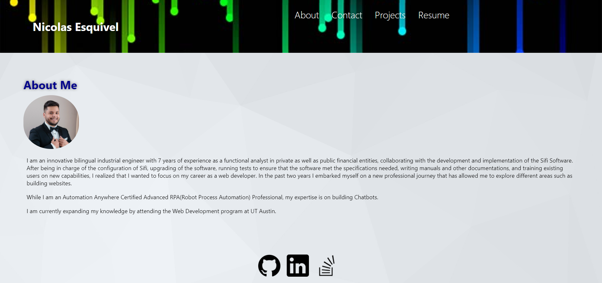

# Portafolio

## Description 

  A website that offers my professional skills.. 

  [Go to the site](https://niko09es.github.io/Portafolio/)

  ## Table of Contents 
   
  * [Installation](#installation)
  * [License](#license)
  * [Contributing](#contributing)
  * [Tests](#tests)
  * [Questions](#Questions)
  
  ## Installation
  
  Clone the repository.
  
  ## License
  
  Licensed under the ISC license.
  
  ## Contributing
  
  Pull requests and stars are always welcome. For bugs and feature requests, please create an issue.
  
  ## Tests
  
  In the terminal run: npm start

  ## Questions

  If you have any further questions contact me on github or my email:

  [NIKO09ES](https://github.com/NIKO09ES)

  [nicolasesquivelruiz@gmail.com](mailto:nicolasesquivelruiz@gmail.com)